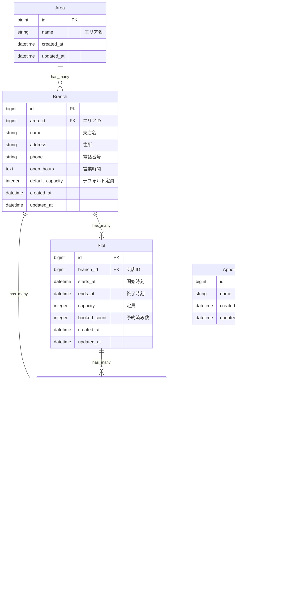

# Database Design & Slot Generation

データベーススキーマ設計とSlot自動生成システムの仕様書です。

---

## ER図



---

## テーブル定義

### areas（エリア）

| カラム名 | データ型 | NULL | デフォルト | 説明 |
|---------|---------|------|----------|------|
| id | bigint | NO | AUTO | 主キー |
| name | string | NO | - | エリア名 |
| created_at | datetime | NO | - | 作成日時 |
| updated_at | datetime | NO | - | 更新日時 |

**インデックス**
- PRIMARY KEY (id)

**バリデーション**
- name: 必須、ユニーク

**マスターデータ（8エリア）**
- 伊豆太陽地区、三島函南地区、伊豆の国地区、あいら伊豆地区
- なんすん地区、御殿場地区、富士地区、富士宮地区

---

### branches（支店）

| カラム名 | データ型 | NULL | デフォルト | 説明 |
|---------|---------|------|----------|------|
| id | bigint | NO | AUTO | 主キー |
| area_id | bigint | NO | - | エリアID（外部キー） |
| name | string | NO | - | 支店名 |
| address | string | NO | - | 住所 |
| phone | string | NO | - | 電話番号 |
| open_hours | text | NO | - | 営業時間 |
| **default_capacity** | **integer** | **NO** | **1** | **デフォルト定員** |
| created_at | datetime | NO | - | 作成日時 |
| updated_at | datetime | NO | - | 更新日時 |

**インデックス**
- PRIMARY KEY (id)
- INDEX (area_id)

**外部キー**
- area_id → areas(id)

**バリデーション**
- name: 必須
- phone: 必須、10-11桁の数字
- **default_capacity: 必須、1以上**（新しいSlot生成時に使用）

**マスターデータ**
- 105支店（各エリアに複数支店）

---

### slots（時間枠）

| カラム名 | データ型 | NULL | デフォルト | 説明 |
|---------|---------|------|----------|------|
| id | bigint | NO | AUTO | 主キー |
| branch_id | bigint | NO | - | 支店ID（外部キー） |
| starts_at | datetime | NO | - | 開始時刻 |
| ends_at | datetime | NO | - | 終了時刻 |
| capacity | integer | NO | 1 | 定員 |
| booked_count | integer | NO | 0 | 予約済み数 |
| created_at | datetime | NO | - | 作成日時 |
| updated_at | datetime | NO | - | 更新日時 |

**インデックス**
- PRIMARY KEY (id)
- INDEX (branch_id)
- **UNIQUE INDEX (branch_id, starts_at)** ← 重複防止

**外部キー**
- branch_id → branches(id)

**バリデーション**
- starts_at: 必須
- ends_at: 必須、starts_atより後
- capacity: 必須、1以上
- booked_count: 必須、0以上、capacity以下

**スコープ**
- `available`: booked_count < capacity
- `future`: starts_at > 現在時刻
- `on_date(date)`: 指定日の枠

**インスタンスメソッド**
- `available?`: 空きあり判定
- `remaining_capacity`: 残り定員
- `increment_booked_count!(count)`: 予約数増加（楽観的ロック付き）
- `decrement_booked_count!(count)`: 予約数減少（楽観的ロック付き）

---

### appointment_types（相談種別）

| カラム名 | データ型 | NULL | デフォルト | 説明 |
|---------|---------|------|----------|------|
| id | bigint | NO | AUTO | 主キー |
| name | string | NO | - | 相談種別名 |
| created_at | datetime | NO | - | 作成日時 |
| updated_at | datetime | NO | - | 更新日時 |

**マスターデータ（6種別）**
- 住宅ローン相談、資産運用相談、保険相談
- 農業融資相談、カードローン相談、その他金融相談

---

### appointments（予約）

| カラム名 | データ型 | NULL | デフォルト | 説明 |
|---------|---------|------|----------|------|
| id | bigint | NO | AUTO | 主キー |
| branch_id | bigint | NO | - | 支店ID（外部キー） |
| slot_id | bigint | NO | - | 時間枠ID（外部キー） |
| appointment_type_id | bigint | NO | - | 相談種別ID（外部キー） |
| name | string | NO | - | 氏名 |
| furigana | string | NO | - | フリガナ |
| phone | string | NO | - | 電話番号 |
| email | string | NO | - | メールアドレス |
| party_size | integer | NO | 1 | 来店人数 |
| purpose | text | YES | - | 相談目的 |
| notes | text | YES | - | 備考 |
| accept_privacy | boolean | NO | false | プライバシー同意 |
| status | integer | NO | 0 | ステータス |
| admin_memo | text | YES | - | 管理者メモ |
| created_at | datetime | NO | - | 作成日時 |
| updated_at | datetime | NO | - | 更新日時 |

**インデックス**
- PRIMARY KEY (id)
- INDEX (branch_id, slot_id, appointment_type_id)
- **UNIQUE INDEX (phone, slot_id)** ← 重複予約防止

**バリデーション**
- name, furigana: 必須
- phone: 必須、10-11桁の数字、同一日の重複不可
- email: 必須、メール形式
- party_size: 必須、1以上
- accept_privacy: 必須（true）

**Enum: status**
- 0: booked（予約済み）
- 1: visited（来店済み）
- 2: needs_followup（要フォローアップ）
- 3: canceled（キャンセル）

---

## データフロー

### 予約作成フロー

```
1. 利用者が予約フォームを入力
   ↓
2. セッションに段階的に保存（session[:reservation]）
   - area_id, branch_id, slot_id, customer_info
   ↓
3. 確認画面で最終確認
   ↓
4. AppointmentService.create_appointment
   ├─ トランザクション開始
   ├─ スロットのロック取得
   ├─ 空き状況の再確認
   ├─ 重複予約チェック
   ├─ Appointmentレコード作成
   ├─ slot.increment_booked_count!（コールバック）
   ├─ コミット
   └─ AppointmentMailJob をキューに追加
   ↓
5. バックグラウンドでメール送信（GoodJob）
   ↓
6. 完了画面を表示
```

### キャンセルフロー

```
1. 管理者がステータスを「キャンセル」に変更
   ↓
2. Appointment#update
   ├─ ステータス更新
   ├─ after_update コールバック発動
   └─ slot.decrement_booked_count!(party_size)
   ↓
3. 予約枠が再び利用可能に
```

---

## Slot自動生成システム

### 概要

- **予約可能期間**: 今月を含む3ヶ月分（常に2ヶ月先まで予約可能）
- **生成タイミング**: 毎月1日 深夜2:00に翌々月分を自動生成
- **実行エンジン**: GoodJob cron

### 生成ロジック

```
1. 対象月の全日をループ（1日～月末）
2. 各日について以下をチェック：
   - 土曜日 → スキップ
   - 日曜日 → スキップ
   - 祝日（holiday_jp gem） → スキップ
   - 年末年始（12/30-1/3） → スキップ
3. 営業日について時間枠を生成（1時間刻み、6枠/日）：
   - 9:00-10:00
   - 10:00-11:00
   - 11:00-12:00
   - 13:00-14:00
   - 14:00-15:00
4. 全105支店それぞれに対して生成
5. capacity = 支店の default_capacity を使用
6. 重複チェック（branch_id + starts_at のユニーク制約）
```

### 休業日判定

**対象の休業日**
- 土曜日、日曜日
- 国民の祝日（holiday_jp gemが管理）
- 年末年始（12/30-1/3）

**判定コード**
```ruby
def business_day?(date)
  return false if date.saturday?
  return false if date.sunday?
  return false if HolidayJp.holiday?(date)
  return false if year_end_new_year?(date)
  true
end

def year_end_new_year?(date)
  (date.month == 12 && date.day >= 30) || (date.month == 1 && date.day <= 3)
end
```

### 実装ファイル

**サービスクラス**: `app/services/slot_generator_service.rb`
- `generate_for_month(year, month)`: 月次一括生成
- `generate_slots_for_branch(branch, date)`: 支店・日付単位生成
- `business_day?(date)`: 営業日判定

**バックグラウンドジョブ**: `app/jobs/slot_generator_job.rb`
- 毎月1日深夜2:00に自動実行
- GoodJob cronで管理

**Rakeタスク**: `lib/tasks/slots.rake`
- `slots:generate_initial`: 初回3ヶ月分生成（デプロイ時）
- `slots:generate_month YEAR=2025 MONTH=3`: 特定月の生成
- `slots:clear_future`: 未来のSlot全削除（注意）

**定期実行設定**: `config/initializers/good_job.rb`
```ruby
config.good_job.cron = {
  generate_monthly_slots: {
    cron: "0 2 1 * *", # 毎月1日 深夜2:00
    class: "SlotGeneratorJob",
    description: "Generate slots for 2 months ahead"
  }
}
```

### 運用コマンド

```bash
# 初回データ生成（デプロイ時）
bin/rails slots:generate_initial

# 特定月の生成
bin/rails slots:generate_month YEAR=2025 MONTH=3

# 動作確認
bin/rails console
> Slot.where('starts_at >= ?', Date.today).group_by { |s| s.starts_at.strftime('%Y年%m月') }.transform_values(&:count)

# ジョブの手動実行
> SlotGeneratorJob.perform_now
```

---

## 関連ドキュメント

- **実装履歴**: [docs/HISTORY.md](HISTORY.md) - Phase 1-5の詳細実装手順
- **開発ガイド**: [docs/DEVELOPMENT.md](DEVELOPMENT.md) - Rakeタスク、テスト
- **システム設計**: [docs/ARCHITECTURE.md](ARCHITECTURE.md) - データモデル階層
